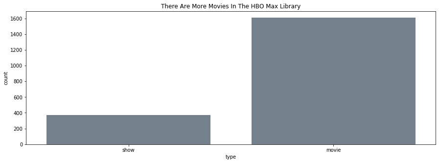
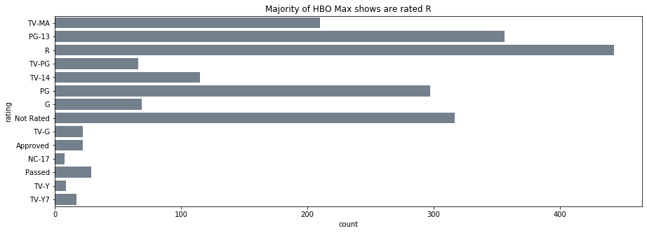
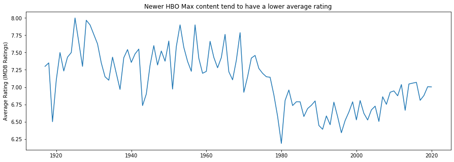
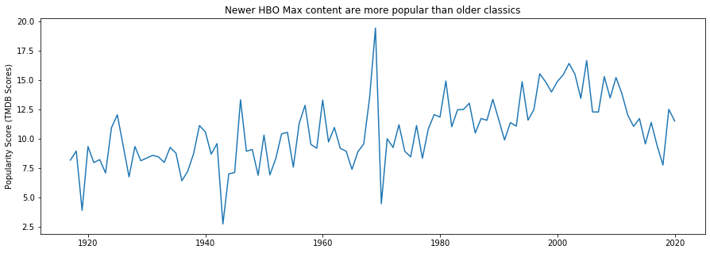
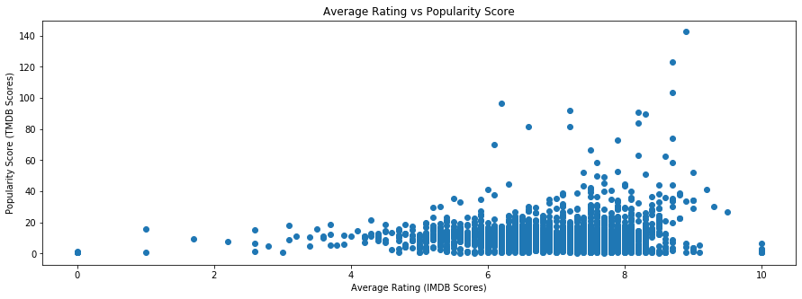

# HBO Max Recommender System

---
### Content: 
- [Problem Statement](#Problem-Statement:)
- [Executive Summary](#Executive-Summary:)
- [Project Files](#Project-Files-(Repository-Organization):)
- [Data Directory](#Data-Directory:)
- [Data Collection and Cleaning](#Data-Collection-and-Cleaning:)
- [Modeling](#Modeling:)
- [Conclusion/ Reccomendations/Future Improvements](#Conclusion/-Reccomendations/-Future-Improvements:)

---

### Problem Statement: 

HBO Max is a streaming service by AT&T, and Warner Media launched on May 27, 2020. It boasts over 10,000 hours of content with 1980 titles (1610 movies and 370) shows. What makes the platform unique is its partnered content providers: ranging from DC Comics, Sesame Workshop, Studio Ghibli, Cartoon Network, Adult Swim, Bad Robot Production, etc. However, with all of its great content, it is falling behind against other competitors. The primary concern is that it lacks a recommender system, which has become an industry standard for streaming services. HBO did try to address the issue with the Recommended by Human, where users can watch testimonies or read tweets about HBO shows. However, this lacks user interface efficiency since they would have to go to another external website to get reviews. Second, Recommended by Human is a not well-known website unless users do a deep dive into the HBO Max platform. Addressing the issues above, I created a Content-Based Recommender System build on HBO Max current library. This system uses subscriber's watch history to return similar titles based on genre, MPAA/TV rating, plot summary, and IMDB ratings. The goal is to incorporate this recommender into the existing HBO Max app to make it easier for HBO Max subscribers to discover new content. 

---

### Executive Summary: 

I establish a Content-Based Recommender system that uses Natural Language Processing (NLP) on a title's genre and plot. Aggregating this vectorized matrix to numerical features such as IMDB rating and encoded MPAA ratings to generate other contents similar to the inputted title. Cosine similarity was used as a basis to filter similar content. The final product will be deployed in Heroku as a proof of concept of the Recommender system. 

---

### Project Files (Repository Organization):

#### Main Directory
- capstone_presentation.pdf
- README.md
- images: stores the images used in the README
- App: contain app.py for the recommender and associated html files
- **Code Directory:**
    - 01_data_collection_cleaning.ipynb: Notebook code for collecting and cleaning HBO Max data. 
    - 02_EDA.ipynb: Notebook code for HBO Max Data EDA
    - 03_recommender.ipynb: Notebook that contains results and analysis for Simple Recommender and Recommender System 1-3. 
    - 04_recommender_BERT.ipynb: Notebook that contains code and results from Recommender 4 and 5 that uses BERT as a vectorizer.
    - **Script Directory:**
        - data_collection.py: Python script used to scrap and organize data to a CSV file.
        - function.py: Python script that contains functions used throughout the project. 
        - models.py: Python script that contains the code for Simple Recommender and Recommender 1-3. 
    - **Pickle Directory:** Contains pickled items
        - log_reg.pkl: Pickled Logistic Regression model 
        - pca.pkl: Pickled PCA model 
        - X.pkl: Pickled X variable used to get predict probabilites. 

---

### Data Directory

|Feature|Type|Description|
|---|---|---|
|ID|integer|Unique JustWatch.com id identifier|
|Title|string|Name of show or movie|
|Type|string| Identify content type as either a show or movie|
|Year|integer|Year released|
|Plot|string|Plot summary of show or movie|
|Genre|list of strings|Genre of shows or movie|
|Rating|string|Motion Picture Association film rating system (MPAA)/TV ratings|
|Popular Score|float|TMDB popularity rating|
|TMDB Rating|float|TMDB rating score (1-10)|
|IMDB Rating|float|IMDB rating score (1-10)|

---

### Data Collection and Cleaning: 

**Data Collection:** 

Due to the JustWatch API's limitations, I utilized a third-party scrapper (JustWatch.py) to gather the entire library for HBO Max. Credit for the scrapper belongs to the original creator [dawoudt](https://github.com/dawoudt/JustWatchAPI). 

Using the JustWatch.py, the first request is focused on collecting the entire HBO Max library. For project simplicity, I only concentrate on contents from the U.S. HBO Max library. An initial pull was done to set as a guide for the remainder of the data collection process. Its output dictionary contains a key called total_count, whose value will act as the while loop parameter. The first request's collected data were arranged into a data frame with columns for id, title, type (show or movie), and year (year released). A problem observed when using the scraper is that it raises an error when the status code is not 200. To mitigate this scenario, I enclosed the while loop in a try and except statement and added print statements to make it easier to continue pulling if the cycle break. Additionally, each request was pickled into a txt file to prevent data loss. 

The second request aims to get the granular detail needed for the EDA and modeling/recommender process. It follows the same procedure as the one described above. The unique id and content type acted as identifiers needed for the scrapper's built-in method for this pull. The final output is a data frame with the following columns (id, plot, MPAA/TV rating, genre, popularity score, IMDB rating, and TMDB rating). The same precautions above were followed this second request. 

For this project, each loop is throttled for 5 seconds to comply with rate-limit policies and politeness. The selected number is from a trial and error process.

The final data frame contains 10 columns and 1980 rows. Around 20% of the data is missings due to the API not processing the information. Therefore, missing values were manually imputed using the information from the IMDB website. For the future, a process similar to the one above would have been ideal. However, IMDB requires an API key to access information. Due to this project's timeline, it would not be feasible to wait for a response on their end. Additionally, their scrapper would require re-doing the entire process again since each show and movie will have a different id.  

Both of the requests steps are done through Amazon's AWS server to maximize time. The script used for this step is located in the script directory under the name data_collection.py

**Data Cleaning:** 

For this step, two functions are implemented (convert_genre and fix_rating) to convert the genre ids to their assigned names and remove the extra space at the end of some MPAA/TV ratings. 

Functions used for this step can be found in the functions.py in the script directory.

---

### Exploratory Data Analysis:

The HBO Max library is consists of 370 TV shows and 1610 movies. The majority of their content has an MPAA/TV rating of R, TV-MA, and PG-13. Additionally, we see that the top genres are Action-Adventure, Comedy, and Drama. Interestingly, these observations follow the history and identity that HBO had established. They started as a tv channel, mainly showing movies targeted for adult audiences.

Additionally, it reflects the platform's partnered content providers. The majority of those film studios and production companies focus on creating films or content targeted for adult audiences. Some examples are Adult Swim, Bad Robot Productions (known for titles such as Alias, Fringe, and Westworld), TBS (known for Conan, Seinfeld, and Friends), and TNT (known for broadcasting classic films). However, HBO Max also offers kid-friendly shows, as seen by their partnership with Sesame Workshop and Cartoon Network. 

**Figure 1: Breakdown of HBO Max content type (Movie or Show)**
 

**Figure 2: HBO Max content by MPAA Rating***

**Figure 3: HBO Max content by genre**

Additionally, I also explore the relationship between year released, popularity score, and IMDB and TMDB ratings. Since the IMDB and TMDB follow similar behavior, for simplicity, the explanation will be clumped into one. There is a negative trend observed for the year released and IMDB/TMDB ratings. Classic shows appear to have a higher average rating than newer shows. In contract, popularity and year release has a positive relationship, where more recent contents are more popular compared to classics.

Furthermore, the majority of HBO Max content has an average rating of between 5-8. Popular titles are well-established shows with a long history with strong fanbases such as Friends, South Park, and Doctor Who. In comparison, the least popular shows are mostly documentaries.

**Figure 4: Year Release vs Populary Score**

**Figure 5: Year Release vs Average Rating**

**Figure 6: Popularity Score vs Average Rating**

---
### Modeling:
The modeling process can be broken down into three categories: Simple Recommender, Content-Based Recommender using TfidVectorizer, and Content-Based Recommender using BERT. 

**Simple Recommender:** This recommender follows a very straightforward approach. It uses various filtering techniques to get the recommended titles. For this recommender, the goal is to build a generalized system that showcases movies/shows that fall within the same genre. Results are then sorted through an engineered feature that multiples the popularity score with IMDB ratings. The logic behind this sorting is that audiences tend to prefer popular shows/movies with high ratings. Although successful, the model suffers from extreme limitations. First, it lacks user personalization, where it will continue to provide the same recommendations to anyone as long as they put the same genre. Second, the established link between contents is relatively shallow; it only considers genre, IMDB ratings, and popularity score, explaining the lack of personalization. 

**Content-Based Recommender using TfidVectorizer:** This recommender utilizes NLP to provide recommendations to users. Unlike the previous recommender, this provides a more personalized result. For this category, three models were developed to test various feature combinations: 
1. **Plot & Genre (Recommender 1):** This model provided a more personalized results compared to the Simple Recommender. This is because it considers the selected title's plot and genre. Although the top four recommended shows are similar to South Park, however, passed that point, the suggested contents are children shows. These shows significantly differ from South Park, which is more explicit and mature. A limitation of this recommender is that it fails to consider MPAA/TV ratings. As seen from the result, the discrepancies arise are from the difference in the content's intended audiences.
2. **Plot, Genre, & Predicted Probabilities of MPAA/TV Ratings (Recommender 2):** For this recommender, I decided to experiment by conducting a Logistic Regression to incorporate the MPAA/TV ratings. The reasoning behind this is that the effects of the features used to train the model could add more weight to the predicted probabilities for the MPAA/TV ratings. In return, it will add more emphasis to the MPAA/TV rating when calculating the similarity score. The model's training features are plot, genre, IMDB ratings, TMDB ratings, year released, popularity score, and type (show/movie). After vectorization of plot and genre, it resulted in a shape of 1980 X 60,000+. To reduce dimensionality, a PCA is implemented, selecting only 50 components. The extracted predicted probabilities are then appended to the document matrix (vectorized plots and genre) and used to calculate the cosine similarity. This recommender did better than Recommender 1. Using the same testing title (South Park), only two recommended shows did not fit with the rest. The observed discrepancy could be caused by the added noise introduced by the prediction probabilities. This approach did improve our result but, at the same time, still maintained a level of error. 
3. **Plot, Genre, MPAA/TV Ratings, & Average Ratings (Recommender 3):** For this recommender, I  decided to incorporate MPAA/TV ratings in a more straightforward method. First, MPAA/TV ratings are encoded into numerical values (selected values are based on own interpretations of those ratings). They are then appended to the same document matrix (plot and genre) together with IMDB ratings to calculate cosine similarity. The idea behind this approach is that it will encoding the MPAA/TV ratings will magnify the its effects when generating recommendations. Out of the three recommenders previously mentioned, this one performed the best, where it is not showing any questionable or error in the recommendations. However, I was curious to see if switching to a more sophisticated vectorizer will affect the results.

**Content-Based Recommender using BERT:** 
1. **Plot, Genre, Average Rating (IMDB & TMDB score), and MPAA/TV Rating (Recommender 4):** For this recommender, I used the same techniques from Recommender 1. I vectorized each selected feature and aggregated them together into a matrix, which was then used to calculate cosine similarity. The results from this recommender are worst compared to the other ones mentioned above. It is giving recommendations that does have any relevance to the testing title (South Park). An explanation for this observation is that similarities are based on the count of identical ids. Therefore, there is a greater emphasis on the plot summary than genre when calculating results.

2. **Plot, Genre, and encoded MPAA/TV Ratings:** To address the problems from Recommender 4, I decided to combine the procedure from Recommender 3 and 4. However, instead of using IMDB ratings, I used the average between the IMDB and TMDB ratings. The resulting recommendations did better than Recommender 4. I began to see more suggested titles similar to South Park. However, it still exhibits recommendations that are different from the testing title. 

**Recommender 3 was used as demo in a flask app. Please look as App directory for details**

---

### Conclusion/ Reccomendations/ Future Improvements:

My recommendation to HBO Max executives is to incorporate Recommender 3 into the existing HBO Max application. It is a Content-Based recommender system that is built on the current HBO Max library. This will be a great next move for the company due to the benefits of Recommender Systems. First, it can improve user's retention rate; catering to user's preferences can lead to long term loyal subscribers. Second, serving similar content leads to habit development that influences users usage pattern. Third, there is a strong correlation between view counts of a video and its top referer video. Lastly, incorporating this recommender will make it easier for subscribers to discover new content without connecting to another external website. 

To differentiate HBO Max from other streaming services, I did not add any bias towards HBO original titles. This is because users' primary concern from other platforms is that recommender systems keep returning original or in-house contents; these remove opportunities to find hidden gems. Similarly, series creators follow the same sentiment, where their creations get canceled due to the higher priority for original titles. Through this method, it gives every title an even playing field for getting recommended. 

As mentioned earlier future aspiration is integrating it into the HBO Max app to offer personalized recommendations to users. Through this, I would also like to conduct an A/B testing with the current HBO interface to test the recommender effectiveness. Lastly, this recommender is just a starting point. Opportunity for improvement includes adding a Collaborative Filtering to Recommender 3 to generate a hybrid system. Additionally, I would like to apply a deep learning model, such as reinforcement learning, so that the system can continuously grow the more the user uses HBO Max. Lastly, I would like to add features, such as directors, keywords, and actors, to the proposed recommender. These additional features will add more complexity to the recommender, resulting in better clustering of similar titles.  

---

### References:
- https://sigmoidal.io/recommender-systems-recommendation-engine/
- https://www.statista.com/statistics/1136139/hbo-now-to-hbo-max-subscribers-post-launch-us/
- https://www.statista.com/statistics/1116918/possible-hbo-max-subscribers-by-generation/
- https://www.statista.com/statistics/778912/video-streaming-service-multiple-subscriptions/
- https://www.researchgate.net/publication/220269659_The_impact_of_YouTube_recommendation_system_on_video_views
- https://fortune.com/2019/07/25/netflix-cancels-tuca-and-bertie-algorithm/
- https://www.kaggle.com/rounakbanik/movie-recommender-systems
- https://www.kdnuggets.com/2019/11/content-based-recommender-using-natural-language-processing-nlp.html
- https://medium.com/@armandj.olivares/building-nlp-content-based-recommender-systems-b104a709c042